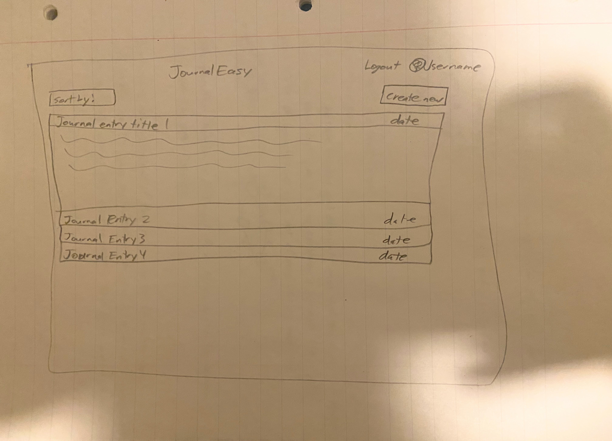
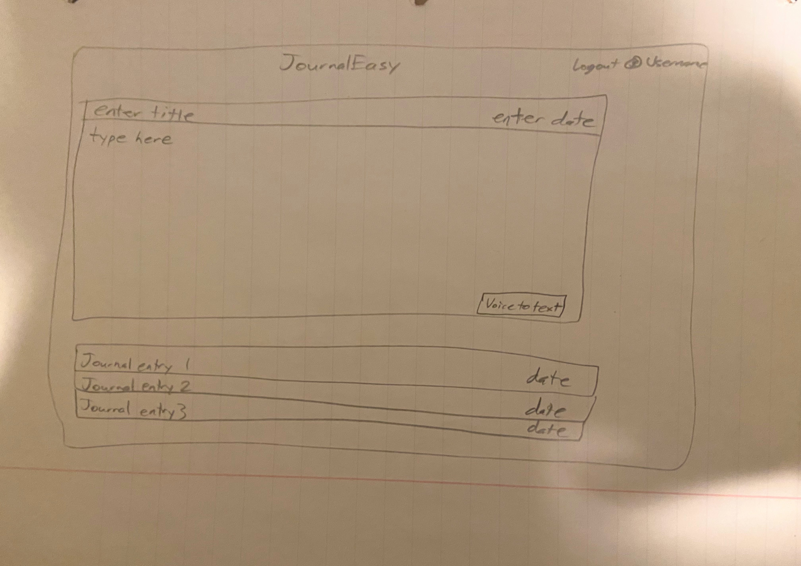
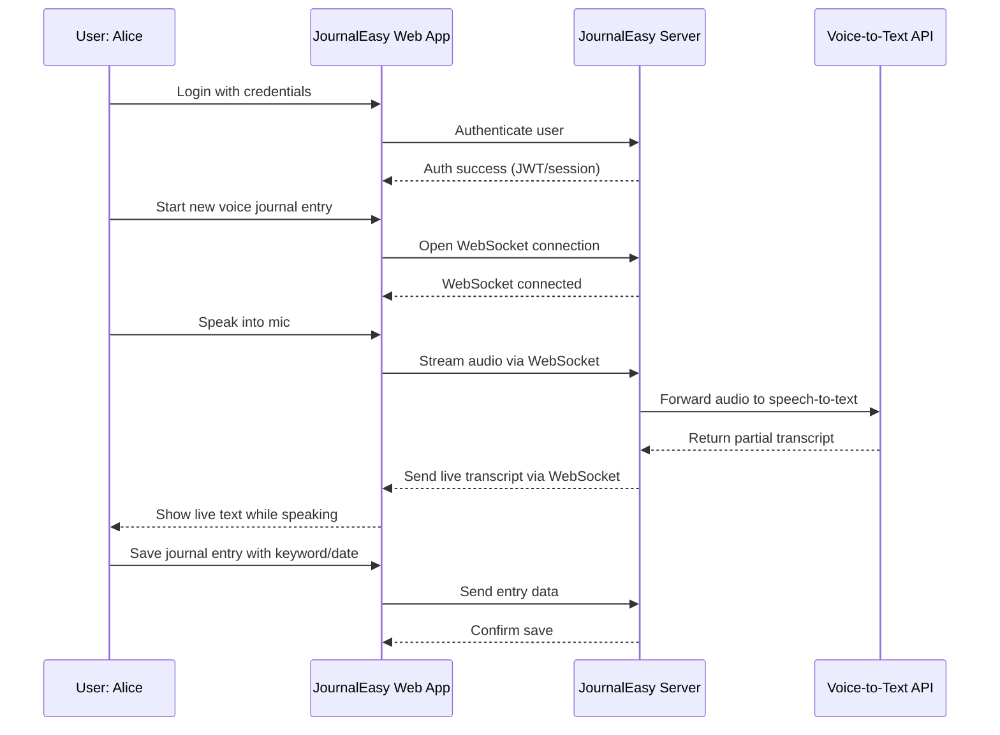

# JournalEasy

[My Notes](notes.md)

A brief description of the application here. Lorem ipsum dolor sit amet, consectetur adipiscing elit, sed do eiusmod tempor incididunt ut labore et dolore magna aliqua. Ut enim ad minim veniam, quis nostrud exercitation ullamco laboris nisi ut aliquip ex ea commodo consequat. Duis aute irure dolor in reprehenderit in voluptate velit esse cillum dolore eu fugiat nulla pariatur. Excepteur sint occaecat cupidatat non proident, sunt in culpa qui officia deserunt mollit anim id est laborum.

> [!NOTE]
>  This is a template for your startup application. You must modify this `README.md` file for each phase of your development. You only need to fill in the section for each deliverable when that deliverable is submitted in Canvas. Without completing the section for a deliverable, the TA will not know what to look for when grading your submission. Feel free to add additional information to each deliverable description, but make sure you at least have the list of rubric items and a description of what you did for each item.

> [!NOTE]
>  If you are not familiar with Markdown then you should review the [documentation](https://docs.github.com/en/get-started/writing-on-github/getting-started-with-writing-and-formatting-on-github/basic-writing-and-formatting-syntax) before continuing.

## 🚀 Specification Deliverable

> [!NOTE]
>  Fill in this sections as the submission artifact for this deliverable. You can refer to this [example](https://github.com/webprogramming260/startup-example/blob/main/README.md) for inspiration.

For this deliverable I did the following. I checked the box `[x]` and added a description for things I completed.

- [x] Proper use of Markdown
- [x] A concise and compelling elevator pitch
- [x] Description of key features
- [x] Description of how you will use each technology
- [x] One or more rough sketches of your application. Images must be embedded in this file using Markdown image references.

### Elevator pitch

Sometimes when big things happen to you, you want to write them down or document them so that you can remember. Or maybe its the small moments that you often forget that seem important to preserve. Either way, journaling by hand can be a little strenuous and when it's late and you're tired it is frequently the first thing to go. But with JournalEasy it is not only quicker to type out your journal entry but since it's digital it is easier to access anywhere and record a quick memory, as well as your memories are backed up and saved no matter what. You can also just talk and have accurate voice to text do the hard work for you. It's a win win! 

### Design

The layout is very simple. Each entry will be minimized to a bar with the name and date showing. There's an option to sort, logout, and create a new entry. Once the "create new" button has been pressed, then an empty template will appear. This template has the option for voice to text or to just type.

### Key features

- Easy login provides access to all journal entries that are backed up on the cloud for protection.
- Online journaling gives options to journal no matter where you are and what device you are on.
- Voice to text permits users to journal while doing other small tasks.

### Technologies

I am going to use the required technologies in the following ways.

- **HTML** - Build the content of the site. One page to login and another to display the journal entries/fill out another entry. The text of the journal entries will all be HTML.
- **CSS** - Help the site look organized with all the journal entries, interesting but not distracting colors for table headers, buttons, etc.
- **React** - Does the actual login, does the backend call when a new journal entry is created, pulls an existing journal entry from the database, helps sort the entries by date, etc.
- **Service** - Has the functionality for the login, creating an account, and logging out. Retrieves journal entries on login, and submits a new created entry. Also will support a voice to text API (I haven't decided what service I want to go with yet).
- **DB/Login** - Stores login information as well as journal entries connected to the user that created them.
- **WebSocket** - The Websocket will make the voice to text live, so that words appear as the person speaks them and they can catch any mistakes or edits they want to make as well as making the experience smoother. I could also send a notification when a different device creates or edits an entry and help multiple devices stay synced.

## 🚀 AWS deliverable

For this deliverable I did the following. I checked the box `[x]` and added a description for things I completed.

- [x] **Server deployed and accessible with custom domain name** - [My server link](https://journaleasy.click).

## 🚀 HTML deliverable

For this deliverable I did the following. I checked the box `[x]` and added a description for things I completed.

- [x] **HTML pages** - I have three pages in my startup, one to login and create an account, one to display all the journal entries and create new ones, and the last one is about the startup.
- [x] **Proper HTML element usage** - I used all the required elements and explored adding a table and other elements as well.
- [x] **Links** - I have three links included at the top of each page that link to the other pages.
- [x] **Text** - I have text on the about page that explains how to use the site and why I created it, and I also have placeholder text on the home page to show where and how journal entries will be displayed.
- [x] **3rd party API placeholder** - I have a button on the home page that will link to the voice to text third party api to create a journal entry by voice.
- [x] **Images** - I included an image of an empty journal on the login page.
- [x] **Login placeholder** - I have a page to login and have an input box for both a username and password, as well as buttons to press login or create account.
- [x] **DB data placeholder** - I have text placeholders of where the journal entries that are in the database under each user will be displayed for the user to go through.
- [x] **WebSocket placeholder** - I wasn't totally sure where to put this placeholder so I have a note on the login page that says that my websocket will be used to sync different devices signed into the same account in realtime. Not sure if that is something I need to display in the website or if that will be fully on the backend of the site.

## 🚀 CSS deliverable

For this deliverable I did the following. I checked the box `[x]` and added a description for things I completed.

- [x] **Header, footer, and main content body** - The header and footer stay at the top and bottom respectively and are a matching color that fits well with the background of the content body. 
- [x] **Navigation elements** - The links are well placed in the header and whatever page you are on, that link is slightly bolded
- [x] **Responsive to window resizing** - I made the body a flex with certain sizing so that as the page scales smaller it should resize to work with the smaller screen.
- [x] **Application elements** - Added the accordion and other items that I wasn't able to put with just the html, made the login more easy to follow.
- [x] **Application text content** - Spaced and styled the text so that it looks better positioned, added color where needed to make the page feel more organized and designed.
- [x] **Application images** - I centered and sized the image so that it scales with the size of the screen.

## 🚀 React part 1: Routing deliverable

For this deliverable I did the following. I checked the box `[x]` and added a description for things I completed.

- [x] **Bundled using Vite** - I created the vite app using npm install vite@latest -D, and then created the tree structure that it is expecting with public and src. Once I had that I could run vite using npm run dev.
- [x] **Components** - I created the app.jsx file which is the base of my page. I changed the home.html, login.html, and about.html into components through .jsx files in my src folder. That was I can just use them as components and the header and footer stay in the app.jsx file and don't get changed when the other components do.
- [x] **Router** - I wrapped the app.jsx return code in a browser router tag, which allowed me to do a separate route or URL for each component and as that certain URL was called, it would import the specific compontent into the app.jsx code and display it.

## 🚀 React part 2: Reactivity deliverable

For this deliverable I did the following. I checked the box `[x]` and added a description for things I completed.

- [x] **All functionality implemented or mocked out** - Everything should be working now except for the third party voice to text api button. The login page gives the user the option to go back and forth between a sign in or sign up option. When the user isn't signed in, the home navlink isn't present. On sign in, the user is redirected to the home page where they can see their journal entries and create new ones. Clicking create entry pulls up a modal where the user can type a title, select a date, and type a body for their entry. When created, the journal appears in the accordion object. There are also an edit and delete buttons to edit or delete the entry.
- [x] **Hooks** - I have a fair amount of useState and useEffect hooks, mostly in the home component and its subcomponents. I use a state variable to track the journal entries, the form for creating a new entry, whether the entry is being edited or not and the index of the entry being edited, etc. These are necessary because even if a user goes to a different page of the website I want the entries to be remembered. I have a couple useEffect hooks in my home component to load the journal entries from localstorage and to save the entries to localstorage.

## 🚀 Service deliverable

For this deliverable I did the following. I checked the box `[x]` and added a description for things I completed.

- [x] **Node.js/Express HTTP service** - I created the service folder that uses Express and node to start up the backend service based on the port that is specified.
- [x] **Static middleware for frontend** - The static files are loaded with express, and the endpoints for the frontend are created in service/index.
- [x] **Calls to third party endpoints** - In the about folder I created a component called "holiday" that does an api call to nager.date and gets the holiday for the current day. If there is no holiday, then "no holiday today" is displayed. If there is a holiday, that holiday gets displayed on the about page.
- [x] **Backend service endpoints** - There are endpoints in the service/index folder that are used to register, log in, and logout a user as well as get, create, edit, and delete a journal entry.
- [x] **Frontend calls service endpoints** - Most of the frontend code that calls to the service endpoints are in home.jsx and login.jsx. Those now call the endpoints to store the information on users and journal entries instead of using localstorage, as well as providing actual functionality on the login page and displaying the journal entries on the home page.
- [x] **Supports registration, login, logout, and restricted endpoint** - The login works correctly where a user has to register first before being able to login. After they are registered, they can log out and log in with no errors. If they don't have an account and they try to login, they are restricted and it doesn't let them in. Logout deletes the auth token and doesn't let them back in until they login again.

## 🚀 DB deliverable

For this deliverable I did the following. I checked the box `[x]` and added a description for things I completed.

- [x] **Stores data in MongoDB** - The journal entries are stored in the database. When the service endpoints are called to create, edit, get, and delete journal entries then the entries are populated into the mongoDB and retrieved from there. The database access is written in service/database.js
- [x] **Stores credentials in MongoDB** - Similar to the data, the service endpoints call methods in service/database.js that put the user email, hashed password, and token into the mongoDB.

## 🚀 WebSocket deliverable

For this deliverable I did the following. I checked the box `[x]` and added a description for things I completed.

- [x] **Backend listens for WebSocket connection** - The backend WebSocket in service/peerProxy.js makes the connection in the backend. It listens for a new connection and if there are multiple connections then it sends a message to the frontend that multiple devices are connected.
- [x] **Frontend makes WebSocket connection** - The frontend WebSocket in src/home/wsClient.js is where the connection is in the frontend. It makes the upgrade from http to ws and has functionality to send messages and what to do when a message is received.
- [x] **Data sent over WebSocket connection** - The data sent over the WebSocket is both a notification that another device connected, as well as once multiple connections are made then if a journal entry is modified in any way (created, edited, deleted) then it is automatically reflected on the other device.
- [x] **WebSocket data displayed** - The journal entry data is displayed but also a notification pops up above the journal entries notifying the user that multiple devices are connected.
- [x] **Application is fully functional** - Everything is working!
